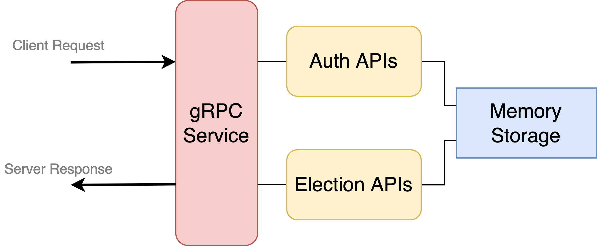

# Core System Design Document

架構圖：



## 簡介

此系統是個簡化版的投票系統，提供的功能只有簡單的投票功能，以及簡單的使用者認證功能。因為此 Project
的目的是要研究 Reliable, Distributed 系統要怎麼設計，有關 Storage 系統並沒有去使用已經很成熟
的 Open Source 系統如 MySQL, PostgreSQL 等常見的 Database 系統，而是簡單的設計了一個
In-Memory 的 Storage 系統，以最簡單的設計方便未來在 Core System 外設計新的容錯設計。

## User Authentication 設計

有兩個部分要討論，第一是 Voter 資料格式為何，以及使用者驗證邏輯。以下是有關使用者驗證的相關 rpc

```
# 提供的 API

rpc PreAuth (VoterName) returns (Challenge);
rpc Auth (AuthRequest) returns (AuthToken);
```

驗證相關的實作可以參考這篇[文件](./user-authentication.md)

## Storage System

為了將來可以更好擴充其他功能及實作，有關 Reliable System 實作上的大議題的儲存系統我把他實作成一
個 Interface，以類似 `Facade` 的 Design Pattern 來實作。

整個 SubSystem 簡單的提供了以下的 Methods:

```go
// Storage Interface Definition
type Storage interface {
	// Initialize the storage
	Initialize(args ...interface{}) error

	// Users
	CreateUser(name string, group string, publicKey string) error
	FetchUser(name string) (User, error)
	RemoveUser(name string) error

	// Elections
	CreateElection(name string, groups []string, choices []string, endDate time.Time) error
	FetchElection(name string) (Election, error)

	// Votes & Results
	VoteElection(electionName string, voterName string, choice string) error
	FetchElectionResults(electionName string) (ElectionResults, error)
}
```

目前支持的 Storage 系統：

- Memory Storage

未來有關 Sync Storage 的實作可以在實作一個 Storage Systen 來達到容錯目的
