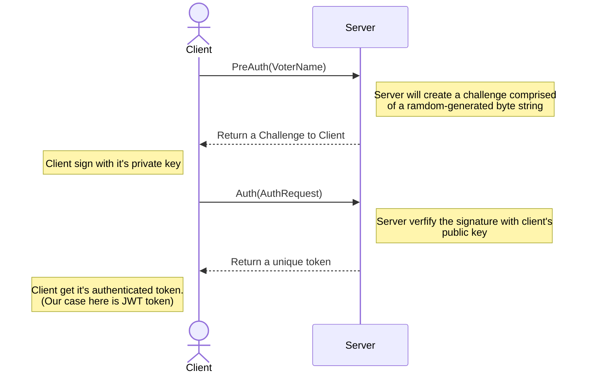

# User Authentication

Keyword: `Certificate-Based Authentication`

## Certificate-Based Authentication 架構

因為我們目前用的是 Detached Mode，所以基本上 Message 的內容不是很重要，反正只要可以 Verify 過 Signature 就行了

## JWT Spec

Algorithm: `HS384`

Payload:

- `exp`: set to expire after **1 hours**
- `name`: set to voter's name
- `group`: set to voter's group

Secret Key: Random generated when server starts up.

### References

- [What Is Certificate-Based Authentication and Why Should I Use It?](https://www.globalsign.com/en/blog/what-is-certificate-based-authentication)
- [golang-jwt/jwt: Community maintained clone of https://github.com/dgrijalva/jwt-go](https://github.com/golang-jwt/jwt)
- [JSON Web Token (JWT) Signing Algorithms Overview](https://auth0.com/blog/json-web-token-signing-algorithms-overview/)
